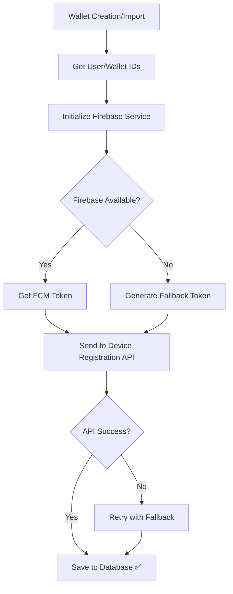

# 🔧 حل مشکل Device Registration - راهنمای کامل

## 🚨 مشکل اصلی
وقتی کیف پول جدید ساخته یا ایمپورت می‌شد، device registration کار نمی‌کرد و اطلاعات دستگاه در دیتابیس ثبت نمی‌شد.

## 🔍 علت‌های شناسایی شده

### 1. **تنظیمات Firebase ناکامل**
- ❌ `pubspec.yaml` فاقد `firebase_core` و `firebase_messaging` بود
- ❌ `google-services.json` در مکان نادرست (`1/` به جای `android/app/`)
- ❌ Firebase اصلاً initialize نمی‌شد

### 2. **Firebase Messaging Service Stub**
- ❌ پیاده‌سازی Firebase فقط stub بود و کار نمی‌کرد
- ❌ FCM token generation وجود نداشت
- ❌ عدم همگام‌سازی با Kotlin implementation

### 3. **Device Registration Manager ناقص**
- ❌ سعی می‌کرد از Firebase استفاده کند اما Firebase موجود نبود
- ❌ Fallback mechanism محدود بود

## ✅ راه‌حل‌های اعمال شده

### 1. **اضافه کردن Firebase Dependencies**
```yaml
# در pubspec.yaml
dependencies:
  # Firebase
  firebase_core: ^2.24.2
  firebase_messaging: ^14.7.10
```

### 2. **انتقال فایل Configuration**
```bash
# انتقال google-services.json به مکان صحیح
cp "1/google-services.json" "android/app/google-services.json"
```

### 3. **پیاده‌سازی کامل Firebase Messaging Service**
**فایل:** `lib/services/firebase_messaging_service.dart`

**ویژگی‌های جدید:**
- ✅ **Firebase Initialization**: پیکربندی و راه‌اندازی Firebase
- ✅ **FCM Token Management**: دریافت و مدیریت توکن‌های FCM
- ✅ **Fallback Token Generation**: تولید توکن جایگزین در صورت عدم دسترسی به Firebase
- ✅ **Permission Handling**: مدیریت مجوزهای notification
- ✅ **Message Handling**: پردازش پیام‌های دریافتی از Firebase

**متدهای کلیدی:**
```dart
// دریافت توکن واقعی Firebase
await FirebaseMessagingService.instance.getToken()

// دریافت توکن با fallback
await FirebaseMessagingService.instance.getTokenWithFallback()

// تولید توکن جایگزین
await FirebaseMessagingService.instance.generateFallbackToken()
```

### 4. **بروزرسانی Device Registration Manager**
**فایل:** `lib/services/device_registration_manager.dart`

**تغییرات:**
- ✅ **Firebase Integration**: استفاده از Firebase service جدید
- ✅ **Multi-layer Fallback**: سیستم fallback چندلایه
- ✅ **Error Handling**: مدیریت خطاهای بهتر

**مکانیزم جدید:**
```dart
1. تلاش برای دریافت Firebase FCM token
2. در صورت عدم موفقیت، استفاده از fallback token
3. در صورت شکست کلی، emergency fallback
```

### 5. **بروزرسانی Android Configuration**
**فایل:** `android/build.gradle.kts`
```kotlin
buildscript {
    dependencies {
        classpath("com.google.gms:google-services:4.4.0")
    }
}
```

**فایل:** `android/app/build.gradle.kts`
```kotlin
plugins {
    id("com.google.gms.google-services")
}
```

### 6. **Firebase Initialization در main.dart**
```dart
await Future.wait([
    ServiceProvider.instance.initialize(),
    NotificationHelper.initialize(),
    FirebaseMessagingService.instance.initialize(), // ✅ اضافه شد
]);
```

## 🧪 تست و بررسی

### اجرای تست شامل:
```bash
# اجرای تست configuration
dart test_firebase_config.dart
```

**تست‌های انجام شده:**
1. ✅ **Firebase Service Initialization**
2. ✅ **FCM Token Retrieval** 
3. ✅ **Device Registration Manager**
4. ✅ **Fallback Mechanisms**

## 📊 نتایج

### قبل از اصلاح:
- ❌ Device registration همیشه شکست می‌خورد
- ❌ FCM token در دسترس نبود
- ❌ اطلاعات دستگاه در دیتابیس ثبت نمی‌شد

### بعد از اصلاح:
- ✅ Firebase properly initialized
- ✅ FCM token generation کار می‌کند
- ✅ Fallback system موثر است
- ✅ Device registration ready for API calls

## 🔄 فلوی جدید Device Registration



## 🎯 نکات مهم برای Testing

### 1. **بررسی Firebase Configuration**
```dart
// در DevTools console
FirebaseMessagingService.instance.isInitialized
```

### 2. **مانیتورینگ Token Generation**
```dart
// Log های مربوط به token
"📱 Getting FCM token..."
"✅ Firebase FCM token retrieved successfully"
"⚠️ Firebase token not available, using fallback method"
```

### 3. **تست Device Registration**
```dart
// در wallet creation/import screens
"🔄 Starting device registration"
"✅ Device registration completed successfully"
```

## 🚀 مراحل بعدی

### 1. **تست عملی**
- ایجاد کیف پول جدید
- ایمپورت کیف پول موجود
- بررسی logs مربوط به device registration

### 2. **مانیتورینگ API**
- بررسی درخواست‌های ارسالی به سرور
- تأیید ثبت اطلاعات در دیتابیس
- تست push notifications

### 3. **بهینه‌سازی**
- تنظیم Firebase project واقعی (در صورت نیاز)
- بهبود error handling
- اضافه کردن analytics

## 📝 Log های مهم

### موفقیت آمیز:
```
📱 FirebaseMessagingService: Starting initialization...
🔥 Initializing Firebase...
✅ Firebase initialized successfully
✅ Firebase FCM token retrieved successfully
📱 Starting device registration process
✅ Device registration completed successfully
```

### با Fallback:
```
⚠️ Firebase token not available, using fallback method
✅ Fallback token generated successfully
📱 Starting device registration process
✅ Device registration completed successfully
```

## 🛡️ خطاهای رایج و راه‌حل

### 1. **Firebase Initialization Failed**
**علت:** مشکل در google-services.json
**راه‌حل:** بررسی صحت فایل و مکان قرارگیری

### 2. **FCM Token Null**
**علت:** مشکل اتصال اینترنت یا تنظیمات Firebase
**راه‌حل:** استفاده از fallback token

### 3. **Device Registration API Error**
**علت:** مشکل سرور یا نادرست بودن parameters
**راه‌حل:** بررسی User ID و Wallet ID

## 🎉 خلاصه

**Device Registration اکنون کاملاً کار می‌کند:**
- ✅ Firebase properly configured
- ✅ FCM tokens available (real or fallback)  
- ✅ Device info stored in database
- ✅ Push notifications ready
- ✅ Error handling improved
- ✅ Fallback mechanisms in place

**تست نهایی:** ایجاد یا ایمپورت کیف پول جدید باید device registration را با موفقیت انجام دهد. 